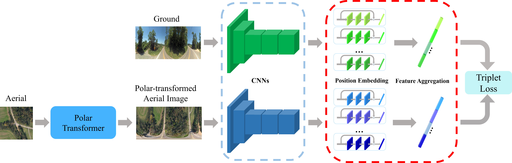

# Spatial-Aware Feature Aggregation for Cross-View Image Based Geo-Localization

This contains the codes for cross-view geo-localization method described in: Spatial-Aware Feature Aggregation for Cross-View Image Based Geo-Localization, NIPS2019. 

# Abstract
Recent works show that it is possible to train a deep network to determine the geographic location of a ground-level image (e.g., a Google street-view panorama) by matching it against a large satellite image covering the wide geographic area of interest. Conventional deep networks, which often cast the problem as a metric embedding task, however, suffer from poor performance in terms of low recall rates. One of the key reasons is the vast differences between the two view modalities, namely ground view versus aerial/satellite view. They not only exhibit very different visual appearances, but also have distinctive (geometric) domain discrepancy. Existing deep methods overlook those appearance and domain differences, and instead use a blind and forceful training procedure, leading to inferior performance. 
In this paper, we develop a new deep network to explicitly address these inherent differences between ground and aerial views.  We observe there exist some approximate domain correspondences between ground and aerial images. Specifically, pixels lying on the same azimuth direction in an aerial image approximately correspond to a vertical image column in the ground view image. Thus, we propose a two-step approach to exploit this prior knowledge. The first step is to apply a regular polar transform to warp an aerial image such that its domain is closer to that of a ground-view panorama.  Note that polar transform as a pure geometric transformation is agnostic to scene content, hence cannot bring the two domains into full alignment. Then, we add a subsequent spatial-attention mechanism which further brings corresponding deep features closer in the embedding space.  To improve the robustness of feature representation, we introduce a feature aggregation strategy via learning multiple spatial embeddings. By the above two-step approach, we achieve more discriminative deep representations, facilitating cross-view Geo-localization more accurate. Our experiments on standard benchmark datasets show significant performance boosting, achieving more than doubled recall rate compared with the previous state of the art. 

### Experiment Dataset
We use two existing dataset to do the experiments

- CVUSA datset: a dataset in America, with pairs of ground-level images and satellite images. All ground-level images are panoramic images.  
	The dataset can be accessed from https://github.com/viibridges/crossnet

- CVACT dataset: a dataset in Australia, with pairs of ground-level images and satellite images. All ground-level images are panoramic images.  
	The dataset can be accessed from https://github.com/Liumouliu/OriCNN

### Dataset Preparation
1. Please Download the two datasets from above links, and then put them under the director "Data/". The structure of the director "Data/" should be:
"Data/CVUSA/
 Data/ANU_data_small/"
2. Please run "data_preparation.py" to get polar transformed aerial images of the two datasets and pre-crop-and-resize the street-view images in CVACT dataset to accelerate the training speed.

### Models:
Our trained models for CVUSA and CVACT are available in [here](https://drive.google.com/open?id=1dH44xSMXCekih8-8CK1_x-76vrMj4whr). 

There is also an "Initialize" model for your own training step. The VGG16 part in the "Initialize" model is initialised by the online model and other parts are initialised randomly. 

Please put them under the director of "Model/" and then you can use them for training or evaluation.

### Codes

1. Training:
	CVUSA: python train_cvusa.py
	CVACT: python train_cvact.py

2. Evaluation:
	CVUSA: python test_cvusa.py
	CVACT: python test_cvact.py

### Results
The recall accuracy

|           |  top-1  |   top-5  |  top-10  |  top-1%  |
| --------- | :-----: | :------: | :------: | :------: |
| CVUSA     |  89.84% |   96.93% |   98.14% |   99.64% |
| CVACT_val |  81.03% |   92.80% |   94.84% |   98.17% |

The complete recall at top K results can be found [here](https://drive.google.com/file/d/1a7zY_z4N7N4kSdSkjd_itJqoqpxI9UJa/view?usp=sharing) in case you want to directly compare with them. 

### Publications
This work is published in NeurIPS 2019.  
[Spatial-Aware Feature Aggregation for Cross-View Image Based Geo-Localization](http://papers.nips.cc/paper/9199-spatial-aware-feature-aggregation-for-image-based-cross-view-geo-localization.pdf)

If you are interested in our work and use our code, we are pleased that you can cite the following publication:  
*Yujiao Shi, Liu Liu, Xin Yu, Hongdong Li.Spatial-Aware Feature Aggregation for Cross-View Image Based Geo-Localization. In Advances in neural information processing systems, Dec 2019.*

@incollection{NIPS2019_9199,
title = {Spatial-Aware Feature Aggregation for Image based Cross-View Geo-Localization},
author = {Shi, Yujiao and Liu, Liu and Yu, Xin and Li, Hongdong},
booktitle = {Advances in Neural Information Processing Systems 32},
editor = {H. Wallach and H. Larochelle and A. Beygelzimer and F. d\textquotesingle Alch\'{e}-Buc and E. Fox and R. Garnett},
pages = {10090--10100},
year = {2019},
publisher = {Curran Associates, Inc.},
url = {http://papers.nips.cc/paper/9199-spatial-aware-feature-aggregation-for-image-based-cross-view-geo-localization.pdf}
}

